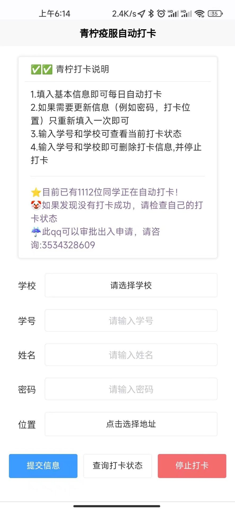

# 青柠疫服自动打卡

基于解析的青柠`api`，实现每日自动打卡。青柠接口写在`/lib/qnyflib.py`中

代码很简单，稍微阅读即可，功能包含：

1. 每日打卡，可自由选择位置
2. 体温打卡

需要说明的是: 

1. YXDM字段是学校代码，在本学校网址可以看见
2. 需要百度[ocr](https://cloud.baidu.com/doc/OCR/s/1k3h7y3db)来自动识别验证码，可以免费申请且有免费额度，申请后修改为自己的即可

## 界面

## 数据库表

|   Yxdm   | Name | Number |  Passed  |   Loc    |
| :------: | :--: | :----: | :------: | :------: |
| 学校代码 | 姓名 |  学号  | 打卡地址 | 打卡地址 |
